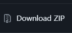

# Welcome to BookWeb

## Introduction

BookWeb is a way for people to be able to communicate about books they care about and to expand the readers of this world

## Vision and Mission

Our vision is a world in which people are again reading much more. Being highlt educated yet again, making the world a better place.

## Key Functionalities

- **Register Process**: An easy way to register with an email and password.
- **Adding books**: There is the function which lets you add any book you want, including your own.
- **Book design**: Our site has this feeling of books when using the site, which not many can offer.

## Usage

**Step 1: Download the resources from our Github repository**

**Step 2: Download and setup Visual Studio code**

You can find the download link here:

**Step 3: Download Live Server from Extensions in Visual Studio Code**

**Step 4: Now right click on the start.html to start the live server**

# The Site

**Discover the magic of the books**

We are welcoming you to rediscover the magic of reading. You can find the link for the site here: [BookWeb](https://main--bookwe.netlify.app/start)

## Welcome to the world of books

Discover the beautiful world of reading and book. Here you can find a collection you will find yourself reading.

## Join The Book Community

We are hoping that with our app you will discover the great in the book community through finding friends from our app.

## Firebase Database

**Overview**

BookWeb uses Firebase Database to store and bring to life some of is contents such as the posts, books and the users authentication. It offers real-time data syncronization, which is the perfects solution for the need of our application.

**Firebase Authentication**

The Firebase Authentication provides the easy and secure login methods for BookWeb

**Firebase Firestore**

Database which helps us store data such as the books in one place, while also offering advanced queries and real-time updates for some of our features.

## Technologies Used

The heart and soul of the project is the triad of technologies also known as HTML, CSS and JavaScript. Their job is to bring to life our app, which then turns into a seamless and responsive user experience, not like any other. Join us by exploring our website.

## Get in Touch

If you want to get in touch with regarding some questions, general feedback or you are passion for books is just that unmatched, we suggest you contact us through this email: boyanbbmilenkov@gmail.com
